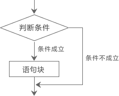

# 0. c++基础入门

## 第一个c++程序

```c++
#include <iostream>//这叫做头文件，前面的“#”号代表预处理文件
//不同的代码需要不同的头文件，比如printf就需要用到<cstdio>头文件。
//你可以把它理解成驱动，或者是配置文件。
//比如说电动车就不能装汽车轮子，要装电动车轮。
//"include"的意思是包含，还用刚才的例子，就是说你的车需要包含这个车轮
//<iostream>的意思是c++标准输入输出流
//i就是input（输入）o就是output（输出）
//stream是流的意思，其实也没什么特殊含义
//有了这个头文件，你就可以使用cin和cout语句，具体什么意思，稍后解释。
//拓展一下，有个万能头文件叫做<bits/stdc++.h>
//这个头文件包含c++中所有的头文件，
using namespace std;
//using namespace std
//这句，比较难理解
//using 也就是使用的意思
//name的动词含义就是命名
//space 有很多意思，什么空格，太空，但是在这里是空间的意思。
//std 标准化的意思，是stand（标准）的简写，在c++头文件中用的很多，比如<cstdio>
//统一来理解，就是使用标准化命名空间
//在c++中是必须写这条语句的，除非你愿意在每条语句（除了预处理）的前面都加上std：：

int main()
//int 也就是创建一个变量，main是主函数的意思，创建主函数，可以理解为程序的入口
{
		cout<<"Hello World"<<endl;
		//这就是cout语句，可以输出一些东西，比如输出语句，就像这条。
		//注意！如果要输出字符的话，必须加""
		//<<就是输出符号，每个cout的后面必须加
		//endl，end，结束。l（line）线。也就是结束这行
    	system("pause")
        //令系统暂停方便观察结果
		return 0;
		//return，就是返回语句。在这里写返回0，也就是程序的出口
		
}


```


```c++
#include <iostream>
using namespace std;
int main()
{
	//打印出来hello world
	cout << "hello world" <<endl;//每行代码都要有分号补全

	system("pause");

	return 0;

}
/*每行末尾用分号隔开
endl是换行的意思*/
```

1. **单行注释**

   通常放在一行代码上方或一条语句末尾//

2. **多行注释**：   /*                  */

   通常放在一段代码上方，对该段代码整体说明

```c++
//单行注释
/*大多行注释*/
```

## 变量

**作用：**c++中所有的数据都会放到**内存**中，变量存在的意义就是方便我们操作这个数据，方便我们管理内存空间

**语法** ：数据类型 数据名称 = 变量初始值；

```c++
#include <iostream>
using namespace std;
/*
	main函数 是一个程序的入口
	每个程序都必须有这么一个函数
	有且仅有一个
*/
int main()
{

	cout << "hello world" << endl; //打印内容

	int a = 10;//创建整型变量a=10

	cout << "a = " << a << endl;

	system("pause");

	return 0;

}
```

## 常量

**作用：**用于记录程序中不可更改的数据

c++定义的常量两种方式

1. **#define**宏常量：
   + 语法：#define 常量名 常量值
   + 通常定义在文件上方，表示一个常量
2. **const**修饰变量
   + 语法：const  数据类型 常量名 = 常量值
   + <u>通常在变量定义前加关键字const</u>，修饰该变量为常量 ，不可修改.

```c++
#include <iostream>
using namespace std;
# define Day 7
int main()
{
	//#define 定义常量
	Day = 214;
	cout << "一周总共有：" << Day << "天 " << endl;
	//const修饰的变量，也成为常量
	const int a = 10;
	a = 12;
	cout << "a = " << a << endl;
	system("pause");
	return 0;
}
```

## 关键字

c++中预先保留的单词

在定义变量或常量的时候不要用关键字

## 标识符命名规则

1. 标识符不可以是关键字
2. 标识符由字母，下划线，数字组成
3. 标识符只能是字母或下划线开头
4. 标识符区分大小写

给变量起名的时候，最好能够见名知意.


# 1.数据类型

## 整形

**定义：**整形变量表示的是正是类型的数据

c++中能够表示整形的类型由以下几种方式，**区别在于占用北村空间不同**

**意义：**给变量分配合适的内存空间，避免空间浪费问题

| 数据类型              | 占用空间                                            | 取值范围       |
| --------------------- | :-------------------------------------------------- | -------------- |
| short（短整型）       | 2字节                                               | (-2^15~2^15-1) |
| int（长整型）         | 4字节                                               | (-2^31~2^31-1) |
| long（长整型）        | windows为4字节，Linux为4字节（32位），8字节（64位） | (-2^31~2^31-1) |
| long long（长长整形） | 8字节                                               | (-2^63~2^63-1) |


## sizeof关键字

**作用：**利用sizeof可以统计数据类型所占内存大小

**语法：**sizeof（数据类型/变量）

**示例：**

```c++
#include <iostream>
using namespace std;
int main(){
	//利用sizeof求出数据类型或者变量所占的内存空间
	short num1 = 10;
	cout << "short占用的空间为：" << sizeof(short) << endl;
	cout << "short占用的空间为：" << sizeof(num1) << endl;
	system("pause");
	return 0;
}
```

## 实型（浮点型）

**作用：**用于表示小数

浮点型变量分为两种

1. 单精度float

2. 双精度double

   两者区别在于表示的有效数字范围不同用

| 数据类型 | 占用空间 | 有效数字范围    |
| -------- | -------- | --------------- |
| float    | 4字节    | 7位有效数字     |
| double   | 8字节    | 15~16位有效数字 |

```c++
#include <iostream>
using namespace std;
int main(){
	//1.单精度 float
	//2.双精度 doube
	float f1 = 3.14;
	/*如果数据末尾没有f，编译器会默认小数位double类型。
	在执行命令时，会把double类型的数据转换成float类型数据
	从而造成内存浪费。
	*/
	float f2 = 3.1415926f;
	double d1 = 3.1415926;
	//默认情况下输出一个小数会显示6位有效数字
	cout << "f2 = " << f2 << endl;
	cout << "d1 = " << d1 << endl;
	//科学计数法
	float f3 = 3e2f; // 3*10^2
	system("pause");
	return 0;
}
```

## 字符型

**作用：**字符型便令用于显示单个字符

**语法：**char 变量名吧 = '单一字符'

+ 注意1：在现实字符型变量时，**用单引号将字符括起来**，**不要用双引号**

+ 注意2：单引号内只能有一个字符，不可以是字符串
+ C/C++中字符型变量只占用一个字节。
+ 字符型变量并不是把字符本身放到内存中储存，而是将对应的ASCII编码存放到存储单元中

```c++
#include <iostream>
using namespace std;
int main(){
	char ch = 'a';
	cout << "ch占用内存时 = " << sizeof(ch) << endl;
    cout << (int)ch << endl;//(int)强制类型转换
	system("pause");
	return 0;
}
```

## 转义字符

**作用：**用于表示一些不能显示出来的ASCII字符

常用的转义字符有 \n \\ \  \t

```c++
#include <iostream>
using namespace std;
int main(){
	cout << "hello world\n"; //\n是换行
	cout << "\\" << endl; //\\时输出“\”
	cout << "aaa\thello world" << endl;
	/*\t表示tab，固定八个字符，不够八个用空
	格补充，可以更整齐的输出后面的内容*/
	cout << "aaaaaa\thello world" << endl;
	system("pause");
	return 0;
}
```


## 字符串

**作用：**表示一串字符

两种风格

- C风格字符串：

  char 变量名[] = "字符串值"

  ```c++
  #include <iostream>
  using namespace std;
  int main(){
  	char str1[] = "hello world";
  	cout << str1 << endl;
  	system("pause");
  	return 0;
  }
  ```

  ==注意C风格要用双引号括起来==

+ c+风格字符串 

  string 变量名 = "字符串值"

  ```c++
  #include <iostream>
  using namespace std;
  #include<string> //头文件 在使用c++类型的字符串的时候需要增加的头文件
  int main(){
  	string str1 = "hello world";
  	cout << str1 << endl;
  	system("pause");
  	return 0;
  }
  ```

  注意：c++风格字符串需要添加头部文件

## 布尔数据 bool

**作用：**布尔数据类型代表真或假的值

bool类型只有两个值

+ true---真(本质是1) 非零即为真
+ false--假(本质是0)

**bool类型占一个字节大小**

```c++
#include <iostream>
using namespace std;
#include<string> //头文件 在使用c++类型的字符串的时候需要增加的头文件
int main(){
	//创建bool类型数据
	bool flag = true;
	cout << flag << endl;
	flag = false;
	cout << flag << endl;
	system("pause");
	return 0;
}
```

## 数据输入

**作用：**用于从键盘获取数据

**关键字：**cin

**语法**：cin >> 变量

```c++
#include <iostream>
using namespace std;
#include<string> //头文件 在使用c++类型的字符串的时候需要增加的头文件
int main(){
	//整形
	int a = 0;
	cout << "请给整形变量a赋值：";
	cin >> a;
	cout << "整形变量a = " << a << endl;
	//浮点型
	float pi = 3.14f;
	cout << "请给浮点型变量pi赋值：";
	cin >> pi;
	cout << pi << endl;
	//字符型
	char ch = 'a';
	cout << "请给字符型变量ch赋值：";
	cin >> ch;
	cout << ch << endl;
	//字符串类型
	string str = "abc";
	cout << "请给字符串变量str赋值：";
	cin >> str;
	cout << str << endl;
	//布尔类型
	bool flag = false;
	cout << "请给bool赋值：";
	cin >> flag;
	cout << flag << endl;
	system("pause");
	return 0;
}
```

# 3.运算符

**作用：**用于执行代码的运算

| 运算符类型 | 作用                                   |
| ---------- | -------------------------------------- |
| 算数运算符 | 用于处理四则运算                       |
| 赋值运算符 | 用于将表达式的值赋给变量               |
| 比较运算符 | 用于表达式的比较，并返回一个真值或假值 |
| 逻辑运算符 | 用于根据表达式的值返回真值或假值       |

## 3.1算数运算符

**作用：**用于处理四则运算

算数运算符号包括以下符号：

| 运算符 | 术语     | 示例      | 结果    |
| ------ | -------- | --------- | ------- |
| +      | 正号     | +3        | 3       |
| -      | 负号     | -3        | -3      |
| +      | 加       | 10+5      | 15      |
| -      | 减       | 10-5      | 5       |
| *      | 乘       | 10*5      | 50      |
| /      | 除       | 10/5      | 2       |
| %      | 取余     | 10%3      | 1       |
| ++     | 前置递进 | a=2;b++a  | a=3;b=3 |
| ++     | 后置递进 | a=2;b=a++ | a=3;b=2 |
| --     | 前置递减 | a=2;b=--a | a=1;b=1 |
| --     | 后置递减 | a=2;b=a-- | a=1;b=2 |

```c++
#include <iostream>
using namespace std;
int main(){
	//加减乘除
	int a1 = 10
	int b1 = 3;
	cout << a1 + b1 << endl;
	cout << a1 * b1 << endl;
	cout << a1 / b1 << endl;
	//两个整数相除结果也一定是整数 ，所以结果是3小数点后的省略了
    //两个小数是不可以取余的
	int b2 = 20;
	cout << a1 / b2 << endl;
	system("pause");
	return 0;
}
```

```c++
#include <iostream>
using namespace std;
#include<string> //头文件 在使用c++类型的字符串的时候需要增加的头文件
int main(){
	//前置递增
	int a = 10;
	++a; //让变量+1
	cout << a << endl;
	//后置递增
	int b = 10;
	++b; //让变量+1
	cout << b << endl;
	//前置递增，先让变量+1 然后进行表达式计算
	//后置递增，先进行表达式计算，再让变量递增
	int a2 = 10;
	int b2 = ++a2 * 10;
	cout << a2 << endl;
	cout << b2 << endl;
	int a3 = 10;
	int b3 = a3++ * 10;
	cout << a3 << endl;
	cout << b3 << endl;
	system("pause");
	return 0;
}
```

## 3.2赋值运算符

**作用：**用于将表达式赋值给变量

| 运算符 | 术语   | 示例       | 结果     |
| ------ | ------ | ---------- | -------- |
| =      | 赋值   | a=2;b=3;   | a=2;b=3; |
| +=     | 加等于 | a=0;a+=2;  | a=2;     |
| -=     | 减等于 | a=5;a-=-3; | a=2;     |
| *=     | 乘等于 | a=2;a*=2;  | a=4;     |
| /=     | 除等于 | a=4;a/=2;  | a=2;     |
| %=     | 模等于 | a=3;a%=3   | a=1;     |

```c++
#include <iostream>
using namespace std;
#include<string> //头文件 在使用c++类型的字符串的时候需要增加的头文件
int main(){
	// = 
	int a = 10;
	a = 100;
	cout << a << endl;
	a += 2;//a=a+2
	cout << a << endl;
	a -= 2;//a=a-2
	cout << a << endl;
	a *= 2;
	cout << a << endl;
	a /= 2;
	cout << a << endl;
	a %= 2;
	cout << a << endl;
	system("pause");
	return 0;
}
```

## 3.3比较运算符

**作用：**用于表达式的比较，。并返回一个真值或假值

| 运算符 | 术语     | 示例 | 结果 |
| ------ | -------- | ---- | ---- |
| ==     | 相等     | 4==3 | 0    |
| !=     | 不等于   | 4!=3 | 1    |
| <      | 小于     | 4<3  | 0    |
| >      | 大于     | 4>3  | 1    |
| <=     | 小于等于 | 4<=3 | 0    |
| >=     | 大于等于 | 4>=3 | 1    |

## 3.4逻辑运算符(与或非)

**作用：**用于根据表达式返回真值或假值

| 运算符 | 术语 | 示例   | 结果                                                     |
| ------ | ---- | ------ | -------------------------------------------------------- |
| ！     | 非   | !a     | 如果a为假，则!a为真；如果a为真，则!a为假。               |
| &&     | 与   | a&&b   | 如果a和b都为真，则结果为真，否则为假。                   |
| \|\|   | 或   | a\|\|b | 如果a和b有一个为真，则结果为真，二者都为假时，结果为假。 |

```c++
#include <iostream>
using namespace std;
#include<string> //头文件 在使用c++类型的字符串的时候需要增加的头文件
int main(){
	// = 
	int a = 10;
	int b = 10;
	cout <<( a && b) << endl; // 要加括号，不然会报错.
	system("pause");
	return 0;
}
```

# 4.程序流程结构

C/C++支持最基本的三种程序运行结构：顺序结构，选择结构，循环结构

+ 顺序结构：程序按照顺序执行，不发生跳转

+ 选择结构：依据条件是否满足，有选择的执行相应的功能

+ 循环结构：依据条件是否满足，循环多次执行某段代码

  

## 4.1选择结构

### if语句

**作用：**执行满足条件的语句

if语句的三种形式

+ 单行格式if语句
+ 多行格式if语句
+ 多条件if语句
+ 嵌套if语句

1. 单行格式if语句：

   if (条件) {条件满足执行的语句}

     

   ```c++
   #include <iostream>
   using namespace std;
   #include<string> //头文件 在使用c++类型的字符串的时候需要增加的头文件
   int main(){
   	int score = 0;
   	cout << "请输入您的高考成绩：";
   	cin >> score;
   	if (score >= 600) cout << "恭喜你考上一本大学" << endl;
   	else  cout << "真可惜你是个彩笔！" << endl;
   	system("pause");
   	return 0;
   }
   ```

2. 多行格式if语句

   if (条件) {条件满足执行的语句} else {条件不满足执行的语句}

     

3. 多条件if语句

   if  (条件1) {满足条件1执行的语句} else if (条件) {条件2满足执行的语句}...else {都不满足执行的语句}

     

```c++
#include<iostream>
using namespace std;
int main() {
	//选择结构中的多条件if语句
	//用户输入一个分数，如果分数大于600，则视为考上一本大学，再输出，如果没有考上一本大学，则打印未考上一本大学
	int score;
	//1.用户输入分数
	cout << "请输入一个分数：";
	cin >> score;
	//2.打印用户输入的分数
	cout << "您输入的分数为：" << score << endl;
	//3.判断分数是否大于600，如果大于则输出考上一本大学，如果大于500分则考上二本大学，，如果大于400分考上三本大学，如果都没考上则输出未考上本科
	if (score >= 600) {
		cout << "您考上一本大学" << endl;
	}
	else if (score >= 500) {
		cout << "您考上二本大学" << endl;
	}
	else if (score >= 400) {
		cout << "您考上三本大学" << endl;
	}
	else {
		cout << "您未考上本科大学" << endl;
	}
	system("pause");
	return 0;
}
```

4. 嵌套if语句

   **在if语句中，可以嵌套使用if语句，达到更精准的条件判断**

   ```c++
   #include<iostream>
   using namespace std;
   int main() {
   	//选择结构中的多条件if语句
   	//用户输入一个分数，如果分数大于600，则视为考上一本大学，再输出，如果没有考上一本大学，则打印未考上一本大学
   	int score;
   	//1.用户输入分数
   	cout << "请输入一个分数：";
   	cin >> score;
   	//2.打印用户输入的分数
   	cout << "您输入的分数为：" << score << endl;
   	//3.判断分数是否大于600，如果大于则输出考上一本大学，如果大于500分则考上二本大学，，如果大于400分考上三本大学，如果都没考上则输出未考上本科
   	if (score >= 600) {
   		cout << "您考上一本大学" << endl;
   		if (score > 700) {
   			cout<<"您能考入北京大学"<<endl;
   		}
   		else if (score > 650) {
   			cout << "您能考上清华大学" << endl;
   		}
   	}
   	else if (score >= 500) {
   		cout << "您考上二本大学" << endl;
   	}
   	else if (score >= 400) {
   		cout << "您考上三本大学" << endl;
   	}
   	else {
   		cout << "您未考上本科大学" << endl;
   	}
   	system("pause");
   	return 0;
   }
   ```

   ```c++
   //比较三只小猪重量
   #include<iostream>
   using namespace std;
   int main() {
   	int num1 = 0;
   	int num2 = 0;
   	int num3 = 0;
   	cout << "请分别输入小猪的重量：";
   	cin >> num1 >> num2 >> num3;
   	cout << num1 << num2 << num3;
   	if (num1 > num2) {
   		if (num1 > num3) {
   			cout << "num1时最重的" << endl;
   		}
   		else if(num1<num3) {
   			cout << "num3是最重的" << endl;
   		}
   		else {
   			cout << "num1与num3一样重" << endl;
   		}
   	}
   	else if (num1 < num2) {
   		if (num2 > num3) {
   			cout << "num2时最重的" << endl;
   		}
   		else if (num2 < num3) {
   			cout << "num3是最重的" << endl;
   		}
   		else {
   			cout << "num2与num3一样重" << endl;
   		}
   
   	}
   	else{
   		if (num1 > num3) {
   			cout << "num1和num2最重" << endl;
   		}
   		else if (num1 < num3) {
   			cout << "num3最重" << endl;
   		}
   		else {
   			cout << "num1与num2与num3一样重" << endl;
   		}
   	}
   	system("pause");
   	return 0;
   }
   
   ```

### 三目运算符

**作用：**通过三目运算符实现简单的判断

语法：表达式1 ？ 表达式2 ：表达式3

> 如果表达式1的值为真，执行表达式2，并返回表达式2的结果
>
> 如果表达式1的值为假，执行表达式3，并返回表达式3的结果

```c++
#include<iostream>
using namespace std;
int main() {
	int a = 10;
	int b = 20;
	int c = 0;
	c= (a > b ? a : b);
	cout << c << endl;
	system("pause");
	return 0;
}
```

### switch语句

**作用：**执行多条件分支语句

> c语言的switch语句是穿透的】这句是理解switch语句的关键：**也就是说当程序判断某个case的条件为真后，它将在执行该case所带的的语句块之后，不再对后面的case的条件进行判断而直接执行。** 所以每个条件后一定要有break

+ if和switch的区别

  switch的缺点，判断的时候只能是整形或者字符型，不可以是一个区间

  switch的优点，结构清晰，执行效率高

语句：

```c++
switch(表达式)
{
    case 1://结果1：
        //执行语句；
        break;
    case 2://结果2：
        //执行语句；
        break;
    ...
    default:
        //执行语句；
        break;
}
```

> 根据表达式结果执行

```c++
#include<iostream>
using namespace std;
int main() {
	//请给电影评分 
	//10 ~ 9   经典   
	// 8 ~ 7   非常好
	// 6 ~ 5   一般
	// 5分以下 烂片
	int score = 0;
	cout << "请给电影打分" << endl;
	cin >> score;
	switch (score)
	{
	case 10:
	case 9:
		cout << "经典" << endl;
		break;
	case 8:
		cout << "非常好" << endl;
		break;
	case 7:
	case 6:
		cout << "一般" << endl;
		break;
	default:
		cout << "烂片" << endl;
		break;
	}
	system("pause");
	return 0;
}
```

## 4.2循环结构

### 4.2.1   while循环语句

**作用：**满足循环条件，执行循环语句

**语法：**while (循环条件) {循环语句}


```c++
#include<iostream>
using namespace std;
int main() {
	int num = 0;
	while (num < 10)
	{
		cout << "num = " << num << endl;
		num+=1;
	}
	system("pause");
	return 0;
}
```

#### 案例：猜字谜游戏

```c++
#include<iostream>
#include<ctime>
using namespace std;
int main() {
	//添加随机数种子通过srand函数srand（1）srand（2）创造不同的随机数种子
    //time(0)是获得秒数
    //(unsigned int)time(0) 强制把秒数转换成整形
	//利用当前系统时间来生成随机数，防止每次随机数都一样
	srand((unsigned int)time(0));
	int num = rand() % 100 + 1;//rand()%100 生成0-99的随机数 伪随机每次随机数都一样
	cout << num << endl;
	bool flag = true;
	int val = 0;
	cin >> val;
	while (1) {
		if (val == num) {
			cout << "牛啊弟弟！" << endl;
			break;//退出循环
		}
		else if (val > num) {
			cout << "大了大了 妞" << endl;
			cin >> val;
		}
		else {
			cout << "小了小了妹妹 " << endl;
			cin >> val;
		}
	}
	system("pause");
	return 0;
}
```

### 4.2.2   do...while循环语句

**作用：**满足循环条件，执行循环语句

**语法：**do{循环语句}while（循环条件）

**注意：**与while不同，do..while会先执行一次循环语句，在判断循环条件。


```c++
#include<iostream>
#include<ctime>
using namespace std;
int main() {

	//do...while 打印0-9这几个数字
	int num = 0;
	do {
		cout << num << endl;
		num += 1;
	}
	while (num < 10);
	system("pause");
	return 0;
}
```

#### 案例：水仙花数

```c++
#include<iostream>
#include<ctime>
using namespace std;
int main() {
	/*水仙花数是指一个三位数，它的每个位上的数字的三次幂之和等于它本身
	1^3+5^3+3^3 = 153
	*/
	int num = 100;
	int a = 0; int b = 0; int c = 0;
	do {
		a = num / 100;
		b = (num - 100 * a) / 10;
		c = (num - 100 * a - 10 * b);
		if ((a *a*a + b *b*b + c *c*c )== num) {
			cout << num << endl;
		}
		num += 1;
	} while (num < 1000);
	system("pause");
	return 0;
}
```

### 4.2.3for循环语句

**作用：**满足循环条件，执行语句

**语法：**for（起始表达式；条件表达式；末尾循环体）{循环语句}

```c++
#include<iostream>
#include<ctime>
using namespace std;
int main() {
	for (int i = 0; i < 10; i++) {
		cout << i << endl;
	}
	system("pause");
	return 0;
}
```

#### 案例：敲桌子

```c++
#include<iostream>
#include<ctime>
using namespace std;
int main() {
	//从1到100，各位或者十位含有7或者是7的倍数，打印敲桌子，其余数字直接打印出来
	int a = 0;
	int b = 0;
	for (int i = 1; i < 101; i++) {
		a = i / 10; // 十位
		b = i - 10 * a; //个位
		if (a == 7 || b == 7 || i % 7 == 0) {
			cout << "敲桌子" << endl;
		}
		else {
			cout << i << endl;
		}
	}
	system("pause");
	return 0;
}
```

### 4.2.4嵌套循环

**作用：**在循环体中在嵌套一层循环，解决一些实际问题

```c++
#include<iostream>
#include<ctime>
using namespace std;
int main() {
	for (int i = 0; i < 10; i++) {
		for (int j = 0; j < 10; j++) {
			cout << "* ";
		}
		cout << endl;
	}
	system("pause");
	return 0;
}
```

#### 案例：乘法口诀表

```c++
#include<iostream>
#include<ctime>
using namespace std;
int main() {
	for (int i = 1; i < 10; i++) {
		for (int j = 1; j <= i; j++) {
			cout << i<<"X"<<j<<"=" << i * j<<"\t";
		}
		cout << endl;
	}
	system("pause");
	return 0;
}

//右上三角
#include<iostream>
#include<ctime>
using namespace std;
int main() {
	int a, b;
	for (a = 1; a <= 9; ++a)
	{
		for (b = 1; b <= 9; ++b)
		{
			if (b >= a) { cout << a << "*" << b << "=" << a * b << "\t"; }
			else { cout << "\t"; }//判断使第2个因数大于第1个因数 
		}
		cout << endl;
	}
	system("pause");
	return 0;
}
```

### 4.2.5跳转语句

#### break语句

**作用：**用于跳出选择结构或者循环结构（退出全部）

break使用时机：

+ 出现在switch语句中，作用是终止case并跳出switch
+ 出现在循环语句中，作用是跳出循环
+ 出现在嵌套循环中，作用是跳出最近的内层循环

#### continue语句

**作用：**在循环语句中，跳过本次循环中余下尚未执行的语句，继续执行下一次循环（退出本次）

```c++
#include<iostream>
#include<ctime>
using namespace std;
int main() {
	for (int i = 0; i <= 100; i++) {
        //只输出奇数
		if (i % 2 == 0) { 
			continue;
		}
		cout << i << endl;
	}
	system("pause");
	return 0;
}
```

#### goto语句

**作用：**可以无条件跳转语句

**语法：**goto 标记；

**解释：**如果标记的名称存在，执行到goto语句的是时候，会跳转到标记的位置。

要尽量少用

```c++
#include<iostream>
#include<ctime>
using namespace std;
int main() {
	//goto 语句
	cout << "1,2,3,4" << endl;
	cout << "1,2,3,4" << endl;
	goto FLAG;
	cout << "1,2,3,4" << endl;
	FLAG://注意标记后要用冒号
	cout << "1,2,3,4" << endl;
	cout << "1,2,3,4" << endl;
	system("pause");
	return 0;
}
```

#### return语句
在函数中，如果碰到return 语句，那么程序就会返回调用该函数的下一条语句执行，也就是说跳出函数的执行，回到原来的地方继续执行下去。但是如果是在主函数中碰到return语句，那么整个程序就会停止，退出程序的执行。

# 5.数组

## 5.1概述

所谓数组，就是一个集合，里面存放了相同类型的数据元素

**特点1：**数组中每个数据元素都是相同的数据类型

**特点2：**数组是由连续的内存位置组成的

### 5.1.1c++数组输出

C++中输出数组数据分两种情况：**字符型数组**和**非字符型数组**

当定义变量为**字符型数组**时，采用cout<<数组名; 系统会输出数组中的字符，如

```c++
char arr[] = {'1', '2'};
cout << arr << endl ; //输出12
```

 如果想输出**字符数组**的地址，则需要进行强制转换，如： 

```c++
char arr[] = {'1', '2'};
cout << static_cast < void *> (arr) << endl ; //按16进制输出str的地址，如：0x310f9ffbf0
```

 当定义变量为**非字符符数组**时，采用cout << 数组名; 系统会输出**数组的地址**，如： 

```c++
int a[] = {1,2,3};
cout << a << endl ; //按16进制输出a的地址，如0x310f9ffbf0
```

 如果需要输出**非字符数组中的内容**，则需要采用**循环**，逐个输出数组中的元素，如： 

```c++
int a[9] = {1, 2, 3}; //初始化前三个元素，其余元素为0
for( int i = 0; i < 10; i++ ) {
     cout << a[i] <<" " ;
     }
cout << endl ; //输出结果：1 2 3 0 0 0 0 0 0
```


## 5.2一维数组

### 5.2.1一维数组定义方式

一维数组定义三种方式：

1. 数据类型  数组名 [数组长度]；
2. 数据类型  数组名 [数组长度] = { 值1，值2...}
3. 数据类型  数组名  [] = {值1，值2...}

```c++
#include<iostream>
#include<ctime>
using namespace std;
int main() {
	/*
		1. 数据类型  数组名 [数组长度]；
		2. 数据类型  数组名 [数组长度] = { 值1，值2...}
		3. 数据类型  数组名  [] = {值1，值2...}
	*/
	//int score[5];
	//score[0] = 5;//定义
	//score[1] = 5;
	//score[2] = 5;
	//score[3] = 5;
	//score[4] = 5;
	//cout << score[1] << endl;//访问
	//int score[5] = { 1,2,3,4,5 };
	//cout << score[1] << endl;//访问
	int score[] = { 1,2,3 };//如果初始化数据的时候，没有填写完，会用0来填补剩余数据
	cout << score[1] << endl;//访问
	system("pause");
	return 0;
}
```

> 注意1：数组命名规则和变量名一样
>
> 注意2：数组下标是从0开始索引的

### 5.2.2一维数组数组名

用途：

1. 可以统计整个数组在内存总的长度
2. 可以获取数组在内从中的首地址

```c++
#include<iostream>
#include<ctime>
using namespace std;
int main() {

	//数组名用途
	//1、可以获取整个数组占用内存空间大小
	int arr[10] = { 1,2,3,4,5,6,7,8,9,10 };
	cout << "整个数组所占内存空间为： " << sizeof(arr) << endl;
	cout << "每个元素所占内存空间为： " << sizeof(arr[0]) << endl;
	cout << "数组的元素个数为： " << sizeof(arr) / sizeof(arr[0]) << endl;
	//2、可以通过数组名获取到数组首地址
	cout << "数组首地址为： " << (int) arr << endl;
	cout << "数组中第一个元素地址为： " << (int)&arr[0] << endl;//不加&就编程调用arr[0]了
	cout << "数组中第二个元素地址为： " << (int)&arr[1] << endl;
	//arr = 100; 错误，数组名是常量，因此不可以赋值
	system("pause");
	return 0;
}
```

#### 案例：五只小猪称体重

```c++
#include<iostream>
#include<ctime>
using namespace std;
int main() {
	//一个数组中记录了五只小猪的体重，找到并打印处最重的。
	int max = 0;//拟定一个最大值
	//当数组中的数值比max大的时候就赋值给max
	int arr[5] = { 100,200,300,470,500 };
	for (int i = 0; i < 5; i++) {
		if (max < arr[i]) {
			max = arr[i];
		}
	}
	cout << max << endl;
	system("pause");
	return 0;
}
```

#### 案例：数组元素逆置

```c++
#include<iostream>
#include<ctime>
using namespace std;
int main() {
	//声明五个元素的数组，并将元素逆置
	//如【5，2，3，1，4】逆置后为【4，1，3，2，5】
	int arr[5] = { 5,2,3,1,4 };
	int arr2[5];
	for (int i = 0; i < 5; i++) {
		for (int j = 4; j > -1; j--) {
			if ((i + j) != 4) { 
				continue;
			}
			arr2[j] = arr[i];
		}
	}
	for (int i = 0; i < 5; i++) {
		cout << arr[i];
	}
	cout << endl;
	for (int i = 0; i < 5; i++) {
		cout << arr2[i];
	}
	system("pause");
	return 0;
}
```

```c++
#include<iostream>
#include<ctime>
using namespace std;
int main() {
	//声明五个元素的数组，并将元素逆置
	//如【5，2，3，1，4】逆置后为【4，1，3，2，5】
	int arr[5] = { 5,2,3,1,4 };
	int start = 0;//起始下标
	int end = sizeof(arr) / sizeof(arr[0]) - 1;//结束下标

	while (end > start) {
        int temp = arr[start];//temporary临时的
		arr[start] = arr[end];
		arr[end] = temp;
		start++;//更新下标
		end--;
	}
	for (int i = 0; i < 5; i++) {
		cout << arr[i];
	}
	cout << endl;
	system("pause");
	return 0;
}
```

### 5.2.3 冒泡排序

**作用：**常用的排序算法，对数组内元素进行排序

1. 比较相邻的元素，如果第一个比第二个大就叫唤他们两个
2. 对每一个相邻元素做同样的工工作，执行完毕后，找到第一个最大值
3. 重复以上步骤，每次比较次数-1，知道不需要比较

```c++
#include<iostream>
#include<ctime>
using namespace std;
int main() {
	int arr[9] = { 4,2,8,0,5,7,1,3,9 };//初始数组
	//总共排序轮数为 元素个数-1
	for (int i = 0; i < 9 - 1; i++){
		//内曾循环次数=元素个数-当前轮数-1
		for (int j = 0; j < 9 - 1 - i; j++){
			if (arr[j] > arr[j + 1]){
				int temp = arr[j];
				arr[j] = arr[j + 1];
				arr[j + 1] = temp;
			}
		}
	}
	for (int i = 0; i < 9; i++){
		cout << arr[i] << endl;
	}
	system("pause");
	return 0;
}
```

## 5.3二维数组

### 5.3.1二维数组定义方式

1. 数据类型 数组名 \[行数][列数];
2. 数据类型 数组名 \[行数][列数]={{数据1，数据2}，{数据3，数据4}}；
3. 数据类型 数组名 \[行数][列数]={数据1，数据2，数据3，数据4}；
4. 数据类型 数组名 \[][列数]={数据1，数据2，数据3，数据4}；

> 第二种最直观可读性最强，最建议使用

```c++
#include<iostream>
#include<ctime>
using namespace std;
int main() {
 
	//方式1  
	//数组类型 数组名 [行数][列数]
	int arr[2][3];
	arr[0][0] = 1;
	arr[0][1] = 2;
	arr[0][2] = 3;
	arr[1][0] = 4;
	arr[1][1] = 5;
	arr[1][2] = 6;
 
	for (int i = 0; i < 2; i++)
	{
		for (int j = 0; j < 3; j++)
		{
			cout << arr[i][j] << " ";
		}
		cout << endl;
	}
 
	//方式2 
	//数据类型 数组名[行数][列数] = { {数据1，数据2 } ，{数据3，数据4 } };
	int arr2[2][3] =
	{
		{1,2,3},
		{4,5,6}
	};
 
	//方式3
	//数据类型 数组名[行数][列数] = { 数据1，数据2 ,数据3，数据4  };
	int arr3[2][3] = { 1,2,3,4,5,6 }; 
 
	//方式4 
	//数据类型 数组名[][列数] = { 数据1，数据2 ,数据3，数据4  };
	int arr4[][3] = { 1,2,3,4,5,6 };
	
	system("pause");
 
	return 0;
}
```

### 5.3.2二维数组的数组名称

+ 查看二维数组所占空间
+ 获取二维数组首地址

```c++
#include<iostream>
#include<ctime>
using namespace std;
int main() {
 
	//二维数组数组名
	int arr[2][3] =
	{
		{1,2,3},
		{4,5,6}
	};
 
	cout << "二维数组大小： " << sizeof(arr) << endl;
	cout << "二维数组一行大小： " << sizeof(arr[0]) << endl;
	cout << "二维数组元素大小： " << sizeof(arr[0][0]) << endl;
 
	cout << "二维数组行数： " << sizeof(arr) / sizeof(arr[0]) << endl;
	cout << "二维数组列数： " << sizeof(arr[0]) / sizeof(arr[0][0]) << endl;
 
	//地址
	cout << "二维数组首地址：" << arr << endl;
	cout << "二维数组第一行地址：" << arr[0] << endl;
	cout << "二维数组第二行地址：" << arr[1] << endl;
 
	cout << "二维数组第一个元素地址：" << &arr[0][0] << endl;
	cout << "二维数组第二个元素地址：" << &arr[0][1] << endl;
 
	system("pause");
 
	return 0;
}
```

#### 案例：考试成绩统计

```c++
#include<iostream>
#include<ctime>
using namespace std;
int main() {
 
	int scores[3][3] =
	{
		{100,100,100},
		{90,50,100},
		{60,70,80},
	};
 
	string names[3] = { "张三","李四","王五" };
 
	for (int i = 0; i < 3; i++)
	{
		int sum = 0;
		for (int j = 0; j < 3; j++)
		{
			sum += scores[i][j];
		}
		cout << names[i] << "同学总成绩为： " << sum << endl;
	}
 
	system("pause");
 
	return 0;
}
```

# 6.函数

## 6.1概述

**作用：**将一段代码封装起来，减少重复代码

一个较大的程序，一般分为诺干个程序块，每个模块实现特定的功能

## 6.2函数的定义

函数的定义一般主要有五个步骤

1. 返回值类型
2. 函数名
3. 参数列表
4. 函数体语句
5. return表达式

**语法：**

```c++
返回值类型 函数名 (参数列表)
{
	函数语主体
	
	return表达式
}
```

- 返回值类型 ：一个函数可以返回一个值。在函数定义中
- 函数名：给函数起个名称
- 参数列表：使用该函数时，传入的数据
- 函数体语句：花括号内的代码，函数内需要执行的语句
- return表达式： 和返回值类型挂钩，函数执行完后，返回相应的数据

```c++
#include<iostream>
#include<ctime>
using namespace std;
//函数定义
int add (int num1, int num2)
{
	int sum = num1 + num2;
	return sum;
}
```

## 6.3函数的调用

**功能：**使用定义好的函数

语法：函数名（参数）

**实参：**调用时的a，b称为实际参数，简称实参

**形参：**定义中的num1,num2称为形式参数，简称形参

```c++
#include<iostream>
#include<ctime>
using namespace std;
//函数定义
int add(int num1, int num2) //定义中的num1,num2称为形式参数，简称形参
{
	int sum = num1 + num2;
	return sum;
}
 
int main() {
 
	int a = 10;
	int b = 10;
	//调用add函数
	int sum = add(a, b);//调用时的a，b称为实际参数，简称实参
	cout << "sum = " << sum << endl;
 
	a = 100;
	b = 100;
 
	sum = add(a, b);
	cout << "sum = " << sum << endl;
 
	system("pause");
 
	return 0;
}
```

## 6.4值传递

+ 所谓值传递，就是函数调用时实参将数值传递给形参
+ 值传递时，**如果形参发生改变，并不会影响实参。**

```c++
#include<iostream>
#include<ctime>
using namespace std;
//值传递
//定义函数，实现两个数字进行交换
//如果函数不需要返回值可以写void，声明不需要返回值
void swap(int num1, int num2) //定义中的num1,num2称为形式参数，简称形参
{
	cout << "交换前" << endl;
	cout << "num1= " << num1 << endl;
	cout << "num2= " << num2 << endl;
	int temp = num1;
	num1 = num2;
	num2 = temp;

	cout << "交换后" << endl;
	cout << "num1= " << num1 << endl;
	cout << "num2= " << num2 << endl;
	//返回值不需要的时候可以不写return
}

int main() {
	int a = 10;
	int b = 20;
	cout << "a= " << a << endl;
	cout << "b= " << b << endl;
	//当我们做值传递的时候，函数的形参发生改变，并不会影响实参
	swap(a, b);
	cout << "a= " << a << endl;
	cout << "b= " << b << endl;
	system("pause");
	return 0;
}
```

## 6.5函数的常见样式

常见函数的样式有四种

1. 无参无返
2. 有参无返
3. 无参有返
4. 有参有返

```c++
#include<iostream>
#include<ctime>
using namespace std;
//函数常见样式
//1、 无参无返
void test01()
{
	//void a = 10; //无类型不可以创建变量,原因无法分配内存
	cout << "this is test01" << endl;
	//test01(); 函数调用
}

//2、 有参无返
void test02(int a)
{
	cout << "this is test02" << endl;
	cout << "a = " << a << endl;
}

//3、无参有返
int test03()
{
	cout << "this is test03 " << endl;
	return 10;
}

//4、有参有返
int test04(int a, int b)
{
	cout << "this is test04 " << endl;
	int sum = a + b;
	return sum;
}
```

## 6.6函数的声明

**作用：**告诉编译器函数名称以及如何调用函数。函数的实际主题可以单独定义。

+ 函数的声明可以多次，但函数的定义只能有一次

```c++
#include<iostream>
#include<ctime>
using namespace std;
//函数的声明
//比较函数，实现两个整形数字的比较，并返回大的值

//提前告诉编译器函数的存在，可以利用函数的声明，可以提前调用函数
//声明
//声明可以写多次，但是定义可以有一次
int max(int a, int b);
int max(int a, int b);
int max(int a, int b);

int main () {
	int a = 10;
	int b = 20;
	cout << max(a, b) << endl;
	system("pause");
	return 0;
}

//定义
int max(int a, int b) {
	return a > b ? a : b;
}
```

## 6.7函数的分文件编写

**作用：**让代码结构更加清晰

函数分文件编写一百年有四个步骤

1. 创建后缀名为.h的头文件
2. 创建后缀名为.cpp的源文件
3. 在头文件中写函数的声明
4. 在源文件中写函数的定义

```c++
//swap.h文件
#include<iostream>
using namespace std;
//实现两个数字交换的函数声明
void swap(int a, int b);
```

```c++
//swap.cpp文件
#include "swap.h"
void swap(int a, int b)
{
	int temp = a;
	a = b;
	b = temp;
	cout << "a = " << a << endl;
	cout << "b = " << b << endl;
}
```

```c++
//main函数文件
#include "swap.h"
int main() {
	int a = 100;
	int b = 200;
	swap(a, b);
	system("pause");
	return 0;
}
 
```

# 7.指针

## 7.1指针的基本概念

**作用：**可以通过指针间接访问内存

+ 内存编号是从0开始记录的，一般用十六进制的数字表示
+ 可以利用指针变量保存地址

## 7.2指针变量的定义和使用

指针变量定义语法：数据类型 * 变量名；

```c++
#include<iostream>
using namespace std;
int main() {
	//1.定义一个指针
	int a = 10;
	//指针定义的语法 :数据类型 * 指针变量；
	int* p; //point 点
	//让指针记录变量的内存地址
	p = &a;//&为取址符号
	cout << "a的地址为" << &a << endl;
	cout << "指针p为" << p << endl; //指针本身就是个地址
	//2.使用指针
	//可以通过解引用的方式来找到指针指向的内存
	*p = 1000;//在指针前加 * ，代表解引用，找到指针指向的内存中的数据
	cout << a << endl;
	cout << *p << endl;
	system("pause");
	return 0;
}
```

指针变量和普通变量的区别

- 普通变量存放的是数据,指针变量存放的是地址
- 指针变量可以通过" * "操作符，操作指针变量指向的内存空间，这个过程称为解引用

> 总结1： 我们可以通过 & 符号 获取变量的地址

> 总结2：利用指针可以记录地址

> 总结3：对指针变量解引用，可以操作指针指向的内存

## 7.3指针所占内存空间

提问：指针也是种数据类型，那么这种数据类型占多少内存 空间

```c++
#include<iostream>
using namespace std;
int main() {
	int a = 10;
	int * p;
	p = &a; //指针指向数据a的地址
	cout << *p << endl; //* 解引用
	cout << sizeof(p) << endl;
	cout << sizeof(char *) << endl;
	cout << sizeof(float *) << endl;
	cout << sizeof(double *) << endl;
	system("pause");
	return 0;
}
```

>  总结：所有指针类型在32位操作系统下是4个字节 ,64位下占8个字节

## 7.4空指针和野指针

**空指针：**指针变量指向内存中编号为0的空间

**用途：**初始化指针变量

**注意：**空指针指向的内存是不可以访问的 //0~255之间的内存是系统占用的，不可以访问

```c++
#include<iostream>
using namespace std;
int main () {
	//空指针
	//1.空指针用于给指针变量进行初始化
	int* p = NULL;
	//2.空指针是不可以访问的
	//0~255之间的内存编号是系统占用的，因此不可以访问
	system("pause");
	return 0;
}
```

**野指针：**指针变量指向非法内存空间

```c++
#include<iostream>
using namespace std;
int main () {
	//野指针
	//在充许钟，尽量避免出现野指针
	int * p = (int * )0x1100;
	cout << *p << endl;
	system("pause");
	return 0;
}
```

> 总结：空指针和野指针都不是我们申请的空间，所以我们也不要去访问

## 7.5 const修饰指针

const修饰指针有三种情况

1. const修饰指针 — 常量指针
   + 常量指针，指针的指向（内存地址）可以修改，但是指针指向的值不可以修改
   + const int * p = &a
2. const修饰常量 — 指针常量
   + int * const p =&a 
   + 指针常量，指针指向的值可以更改，但是指针的指向（内存地址）不可以改
3. const即修饰指针，又修饰常量
   + const int * const p = &a
   + 指针的指向和指针指向的值都不可以改

```c++
int main() {
 
	int a = 10;
	int b = 10;
	//const修饰的是指针，指针指向可以改，指针指向的值不可以更改
    //const锁定后面紧跟的 跟着*p操作就错误了.
    //紧跟着p p = &b的操作就错误了
	const int * p1 = &a; 
	p1 = &b; //正确
	//*p1 = 100;  报错
	
 
	//const修饰的是常量，指针指向不可以改，指针指向的值可以更改
	int * const p2 = &a;
	//p2 = &b; //错误
	*p2 = 100; //正确
 
    //const既修饰指针又修饰常量
	const int * const p3 = &a;
	//p3 = &b; //错误
	//*p3 = 100; //错误
    
	system("pause");
	return 0;
}
```

>  技巧：看const右侧紧跟着的是指针还是常量, 是指针就是常量指针，是常量就是指针常量 

## 7.6指针和数组

**作用：**利用指针访问数组

```c++
#include<iostream>
using namespace std;
int main () {
	//利用指针访问数组中的元素
	int arr[10] = { 1,2,3,4,5,6,7,8,9,10 };
	cout << "访问数组中的第一个元素" << arr[0] << endl;

	int * p = arr;//arr就是数组的首地址
	cout <<"第一个元素是"<< * p << endl;
	cout << sizeof(*p) << endl;//指针占四个字节
	p++;//让指针向后偏移四个字节
	cout <<"第二个元素是"<< * p << endl;
	cout << "利用指针遍历数组" << endl;
	int* p2 = arr;
	for (int i = 0; i < 10; i++) {
		cout << *p2 << endl;
		p2++;
	}
	system("pause");
	return 0;
}
```

## 7.7 指针和函数

**作用：**利用指针作函数参数，可以修改实参的值

```c++
#include<iostream>
using namespace std;
//实现两个数字进行交换
void swap01(int a, int b) {
	int temp = a;
	a = b;
	b = temp;
	cout <<"swap01 a="<< a << endl;
	cout <<"swap01 b="<< b << endl;
}
void swap02(int* p1, int* p2) {
	int temp = *p1;
	*p1 = *p2;
	*p2 = temp;
}
int main () {
	//指针和传递
	//1.值传递
	int a = 10;
	int b = 20;
	swap01(a, b);
	cout << "a=" << a << endl;
	cout << "b=" << b << endl;
	//2.地址传递
	swap02(&a,&b);
	cout << "a=" << a << endl;
	cout << "b=" << b << endl;
	system("pause");
	return 0;
}
```

> 总结：如果不想修改实参，就用值传递，如果想修改实参，就用地址传递 

### 案例：指针，数组，函数

封装一个函数，利用冒泡排序，实现对整型数组的升序排列

```c++
#include<iostream>
using namespace std;
//冒泡排序 参数1数组首地址 参数2数组长度
void bubble_Sort(int * arr, int len) {   //bubble 气泡 泡沫
	for (int i = 0; i < len - 1; i++) {
		for (int j = 0; j < len - i - 1; j++) {
			//如果j>j+1的值交换数字
			if (arr[j] > arr[j + 1]) {
				int temp = arr[j];
				arr[j] = arr[j + 1];
				arr[j + 1] = temp;
			}
		}
	}
}
//array 数组 一系列的
void printArray(int * arr, int len) {
	for (int i = 0; i < len; i++) {
		cout << arr[i] << endl;
	}

}  
int main () {
	//1.先创建数组
	int arr[10] = { 8,9,5,4,3,2,7,59,6,1 };
	//2.计算数组长度
	int len = sizeof(arr) / sizeof(arr[0]);
	//3.调用函数，实现冒泡排序
	bubble_Sort(arr, len);
	//4.打印结果
	printArray(arr, len);
	system("pause");
	return 0;
}
```

# 8.结构体

## 8.1结构体的基本概念

结构体术语用户**自定义的数据类型**，允许用户储存不同的数据类型


## 8.2结构体的定义与使用

 **语法：** struct 结构体名 {结构体成员列表}

通过结构体创建变量的方式有三种：

- struct 结构体名 变量名
- struct 结构体名 变量名 = { 成员1值 ， 成员2值…}
- 定义结构体时顺便创建变量

```c++
#include<iostream>
using namespace std;
#include<string>
//1.创建学生数据类型，学生包括 年龄 分数 姓名
struct student
{
	//成员列表
	string name;  //姓名
	int age;      //年龄
	int score;    //分数
	void a() {
		cout << "wobe" << endl;
	}
}stu3; //结构体变量创建方式3  用的少
int main() {
	//2.通过结构体创建具体的学生
	//结构体变量创建方式1
	struct student stu1; //struct 关键字可以省略
	stu1.name = "张三";
	stu1.age = 18;
	stu1.score = 100;
	stu1.a();
	cout << "姓名：" << stu1.name << " 年龄：" << stu1.age << " 分数：" << stu1.score << endl;

	//结构体变量创建方式2
	struct student stu2 = { "李四",19,60 };
	cout << "姓名：" << stu2.name << " 年龄：" << stu2.age << " 分数：" << stu2.score << endl;


	stu3.name = "王五";
	stu3.age = 18;
	stu3.score = 80;
	cout << "姓名：" << stu3.name << " 年龄：" << stu3.age << " 分数：" << stu3.score << endl;

	system("pause");
	return 0;
}
```

> 总结1：定义结构体时的关键字是struct，不可省略

> 总结2：创建结构体变量时，关键字struct可以省略

> 总结3：结构体变量利用操作符 ‘’.’’ 访问成员

## 8.3结构体数组

**作用：**将自定义的结构体放入到数组中方便维护

**语法：**`struct 结构体名 数组名[元素个数] = { {} , {} , ... {} }`

```c++
#include<iostream>
using namespace std;
#include<string>
//1.创建学生数据类型，学生包括 年龄 分数 姓名
//1.结构体定义
struct Student
{
	//成员列表
	string name;  //姓名
	int age;      //年龄
	int score;    //分数
};
int main() {

	//2.创建结构体数组
	struct Student arr[3] =
	{
		{"张三",18,80 },
		{"李四",19,60 },
		{"王五",20,70 }
	};

	//3.给结构体数组中的元素赋值
	arr[1].name = "刘妃";
	arr[1].age = 18;
	arr[1].score = 100;
	//4.遍历结构体数组
	for (int i = 0; i < 3; i++)
	{
		cout << "姓名：" << arr[i].name << " 年龄：" << arr[i].age << " 分数：" << arr[i].score << endl;
	}

	system("pause");

	return 0;
}
```

## 8.4结构体指针

**作用：**通过指针访问结构体中的成员

+ 利用操作符`->`可以通过结构体指针访问结构体属性

```c++
#include<iostream>
using namespace std;
#include<string>
//结构体指针
//定义结构体
struct Student
{
	//成员列表
	string name;  //姓名
	int age;      //年龄
	int score;    //分数
};
int main() {

	//1.创建学生的结构体变量
	struct Student s = { "刘妃",18,100 };
	//2.通过指针来指向结构体变量
	struct Student * p = &s; //struct 可以省略

	//3.通过指针访问结构体变量中的数据
	//通过结构体指针 访问结构体中的属性，需要利用“->”
	s.name;
	cout << "姓名：" << p->name << endl;
	cout << "年龄：" << p->age << endl;
	cout << "分数：" << p->score << endl;
	system("pause");

	return 0;
}
```

## 8.5结构体嵌套结构体

**作用：** 结构体中的成员可以是另一个结构体

**例如：**每个老师辅导一个学员，一个老师的结构体中，记录一个学生的结构体

```c++
#include<iostream>
using namespace std;
#include<string>
//学生结构体定义
struct student
{
	//成员列表
	string name;  //姓名
	int age;      //年龄
	int score;    //分数
};
//教师结构体定义
struct teacher
{
	//成员列表
	int id; //职工编号
	string name;  //教师姓名
	int age;   //教师年龄
	struct student stu; //子结构体 学生
};
int main() {
	struct teacher t1;
	t1.id = 10000;
	t1.name = "老王";
	t1.age = 40;
	t1.stu.name = "张三";
	t1.stu.age = 18;
	t1.stu.score = 100;
	cout << "教师 职工编号： " << t1.id << " 姓名： " << t1.name << " 年龄： " << t1.age << endl;
	cout << "辅导学员 姓名： " << t1.stu.name << " 年龄：" << t1.stu.age << " 考试分数： " << t1.stu.score << endl;
	system("pause");

	return 0;
}
```

>  **总结：**在结构体中可以定义另一个结构体作为成员，用来解决实际问题 


## 8.6 结构体做函数参数

**作用：**将结构体作为参数向函数中传递

传递方式有两种：

- 值传递
- 地址传递

```c++
#include<iostream>
using namespace std;
#include<string>
//学生结构体定义
struct student
{
	//成员列表
	string name;  //姓名
	int age;      //年龄
	int score;    //分数
};

//值传递
void printStudent(student stu)
{
	stu.age = 28;
	cout << "子函数中 姓名：" << stu.name << " 年龄： " << stu.age << " 分数：" << stu.score << endl;
}

//地址传递
void printStudent2(student* stu)
{
	stu->age = 28;
	cout << "子函数中 姓名：" << stu->name << " 年龄： " << stu->age << " 分数：" << stu->score << endl;
}

int main() {

	student stu = { "张三",18,100 };
	//值传递
	printStudent(stu);
	cout << "主函数中 姓名：" << stu.name << " 年龄： " << stu.age << " 分数：" << stu.score << endl;

	cout << endl;

	//地址传递
	printStudent2(&stu);
	cout << "主函数中 姓名：" << stu.name << " 年龄： " << stu.age << " 分数：" << stu.score << endl;

	system("pause");

	return 0;
}
```

>  总结：如果不想修改主函数中的数据，用值传递，反之用地址传递 

## 8.7结构体中const的使用场景

 **作用：**用const来防止误操作 

```c++
#include<iostream>
using namespace std;
#include<string>
//学生结构体定义
struct student
{
	//成员列表
	string name;  //姓名
	int age;      //年龄
	int score;    //分数
};

//const使用场景
//将函数中的形参改为指针，不会复制新的副本出来，可以减少内存空间
void printStudent(const student* stu) //加const防止函数体中的误操作
{
	//stu->age = 100; //操作失败，因为加了const修饰
	cout << "姓名：" << stu->name << " 年龄：" << stu->age << " 分数：" << stu->score << endl;

}

int main() {

	student stu = { "张三",18,100 };

	printStudent(&stu);

	system("pause");

	return 0;
}
```

### 结构体案例1

记录三个老师的五个学生的姓名和分数

```c++
#include<iostream>
using namespace std;
#include<string>
//学生结构体定义
struct Student {
	string name; //姓名
	int score;//得分
};
//老师结构体定义
struct Teacher {
	string name;
	struct Student arr[5];
};
void record(struct Teacher tarr[], int len) {
	for (int i = 0; i < len; i++) {
		string tname = "a";
		cout << "请输入老师的名称：";
		cin >> tname;
		tarr[i].name = tname;

		for (int j = 0; j < 5; j++) {
			string tname = "a";
			cout << "请输入老师名下学生的名称：";
			cin >> tname;
			tarr[i].arr[j].name = tname;
			int num = 0;
			cout << "请输入老师名下学生的成绩：";
			cin >> num;
			tarr[i].arr[j].score = num;
		}
	}
}

int main() {

	//创建三名老师的数组
	struct Teacher tarr[3];
	int len = sizeof(tarr) / sizeof(tarr[0]);
	//通过函数给3名老师的信息赋值，并给老师带的学生信息赋值
	record(tarr, len);
	//打印出老师与学生的信息
	for (int i = 0; i < 3; i++) {
		cout << "老师姓名" << endl;
		cout << tarr[i].name << endl;
		for (int j = 0; j < 5; j++) {
			cout << "姓名\t";
			cout << tarr[i].arr[j].name<<"\t";
			cout << "成绩\t" ;
			cout << tarr[i].arr[j].score << endl;
		}
	}
	system("pause");

	return 0;
}
```

### 结构体案例2

设计一个英雄结构体，包括姓名，年龄，性别，创建结构体数组存放五名英雄。
通过冒泡排序的算法，将数组中英雄按年龄进行升序排列，最终打印出来
```c++
#include<iostream>
using namespace std;
#include<string>
//定义结构体
struct hero {
	string name;
	int age;
	string sex;
};
//冒泡排序 实现年龄的升序排列
void bubbleSort(struct hero hero_array[], int len) {
	for (int i = 0; i < len - 1; i++) {
		for (int j = 0; j < len - i - 1; j++) {
			//j下标的年龄大于j+1的年龄交换两个元素
			if (hero_array[j].age < hero_array[j + 1].age) {
				struct hero  temp = hero_array[j];
				hero_array[j] = hero_array[j + 1];
				hero_array[j + 1] = temp;
			}
		}
	}
}
void printhero(struct hero hero_array[], int len) {
	for (int i = 0; i < len; i++) {
	cout << "姓名：" << hero_array[i].name << "年龄：" << hero_array[i].age << "性别：" << hero_array[i].sex << endl;
	}

}


int main() {

	//2.创建数组存放5名英雄
	struct hero hero_array[5] = {
		{"刘备",23,"男"},
		{"关羽",22,"男"},
		{"张飞",20,"男"},
		{"赵云",21,"男"},
		{"貂蝉",19,"女"}
	};
	int len = sizeof(hero_array) / sizeof(hero_array[0]);
	//for (int i = 0; i<len; i++) {
	//	cout << "姓名：" << hero_array[i].name << "年龄：" << hero_array[i].age << "性别：" << hero_array[i].sex << endl;
	//}
	//3.对数组进行排序，按照年龄进行升序排序
	bubbleSort(hero_array, len);
	//4.将排序后结构体打印输出
	printhero(hero_array, len);
	system("pause");

	return 0;
}
```

# 9.通讯录关系系统
**通讯录功能**
+ 添加联系人
+ 显示联系人
+ 删除联系人
+ 查找联系人
+ 修改联系人
+ 清空联系人
+ 推出通讯录
```c++
#include<iostream>
using namespace std;
#define max 1000 //定义max的大小
//联系人结构体
struct Person {
	string m_Name;
	int m_Sex;
	int m_Age;
	string m_Phone;
	string m_Addr;
};
//通讯录结构体
struct Addressbooks {
	struct Person personArray[max];//通讯录中保存的联系人数组
	int m_Size;//通讯录中人员个数
};

//菜单界面
void showMenu() {
	cout << "|----1.添加联系人----|" << endl;
	cout << "|----2.显示联系人----|" << endl;
	cout << "|----3.删除联系人----|" << endl;
	cout << "|----4.查找联系人----|" << endl;
	cout << "|----5.修改联系人----|" << endl;
	cout << "|----6.清空联系人----|" << endl;
	cout << "|----0.退出通讯录----|" << endl;
}
//add contact
void add_person(Addressbooks* abs) {
	//判断通讯录是否已满
	if (abs->m_Size == max) {
		cout << "通讯录已满" << endl;
		return;
	}
	else {
		//添加联系人信息
		//姓名
		string name;
		cout << "请输入姓名" << endl;
		cin >> name;
		abs->personArray[abs->m_Size].m_Name = name;
		//性别
		cout << "请输入性别" << endl;
		cout << "1---男" << endl;
		cout << "2---女" << endl;
		int sex = 0;
		while (true) {
			cin >> sex;
			if (sex == 1 || sex == 2) {
				abs->personArray[abs->m_Size].m_Sex = sex;
				break;
			}
			else {
				cout << "输入有误请重新输入" << endl;
			}
		}
		//年龄
		cout << "please input your age" << endl;
		int age;
		cin >> age;
		abs->personArray[abs->m_Size].m_Age = age;
		//联系电话
		string phone;
		cout << "please input your phone number" << endl;
		cin >> phone;
		abs->personArray[abs->m_Size].m_Phone = phone;
		//家庭住址
		string address;
		cout << "please input your address" << endl;
		cin >> address;
		abs->personArray[abs->m_Size].m_Addr = address;
		//更新通信录人数
		abs->m_Size++;
		cout << "successfully added" << endl;
		system("pause"); // 请按任意键继续
		system("cls"); // 清屏
	}
}
//show contacts
void show_person(Addressbooks* abs) {
	if (abs->m_Size == 0) {
		cout << "There are no contacts here" << endl;
	}
	else {
		for (int i = 0; i < abs->m_Size; i++) {
			cout << "name:" << abs->personArray[i].m_Name << "\t";
			cout << "sex:" <<( abs->personArray[i].m_Sex == 1?"男":"女" )<< "\t";
			cout << "age:" << abs->personArray[i].m_Age << "\t";
			cout << "phone:" << abs->personArray[i].m_Phone << "\t";
			cout << "address:" << abs->personArray[i].m_Addr << endl;
		}
	}
	system("pause");
	system("cls");
}

//Check whether the contact exists. If so, return the specific location. If not, return -1 
int isExist(Addressbooks * abs, string name) {
	for (int i = 0; i < abs->m_Size; i++) {
		if (abs->personArray[i].m_Name == name) {
			return i; //if so return the specific location
		}
	}
	return -1;// if not return -1
}

//delete contact
void delete_person(Addressbooks* abs) {
	cout << "please input contact name which one you want delete" << endl;
	string name;
	cin >> name;
	int ret = isExist(abs, name);//这里abs已经是指针了
	if (ret == -1) {
		cout << "wrong name" << endl;
	}
	else {
		for (int i = ret; i < abs->m_Size; i++) { // 数据前移
			abs->personArray[i] = abs->personArray[i + 1];
		}
		abs->m_Size--; // 更新通讯录中人数
		cout << "successfully delete" << endl;
	}
	system("pause");
	system("cls");
}

void find_person(Addressbooks* abs) {
	cout << "请输入您要查找的联系人" << endl;
	string name;
	cin >> name;
	int ret = isExist(abs, name);
	if (ret != -1) {
		cout << "name:" << abs->personArray[ret].m_Name << "\t";
		cout << "sex:" << (abs->personArray[ret].m_Sex == 1 ? "男" : "女") << "\t";
		cout << "age:" << abs->personArray[ret].m_Age << "\t";
		cout << "phone:" << abs->personArray[ret].m_Phone << "\t";
		cout << "address:" << abs->personArray[ret].m_Addr << endl;
	}
	else {
		cout << "wrong name" << endl;
	}
	system("pause");
	system("cls");
}
//change contact
void modify_person(Addressbooks* abs) {
	cout << "please input contact name which one you want to change" << endl;
	string name;
	cin >> name;
	int ret = isExist(abs, name);
	if (ret != -1) {
		//姓名
		string name;
		cout << "请输入姓名" << endl;
		cin >> name;
		abs->personArray[ret].m_Name = name;
		//性别
		cout << "请输入性别" << endl;
		cout << "1---男" << endl;
		cout << "2---女" << endl;
		int sex = 0;
		while (true) {
			cin >> sex;
			if (sex == 1 || sex == 2) {
				abs->personArray[ret].m_Sex = sex;
				break;
			}
			else {
				cout << "输入有误请重新输入" << endl;
			}
		}
		//年龄
		cout << "please input your age" << endl;
		int age;
		cin >> age;
		abs->personArray[ret].m_Age = age;
		//电话
		string phone;
		cout << "please input your phone number" << endl;
		cin >> phone;
		abs->personArray[ret].m_Phone = phone;
		//地址
		string address;
		cout << "please input your address" << endl;
		cin >> address;
		abs->personArray[ret].m_Addr = address;

		cout << "successfully modify" << endl;
	}
	else {
		cout << "wrong name" << endl;
	}
	system("pause");
	system("cls");
}
//clear contact
void clean_person(Addressbooks* abs) {
	abs->m_Size = 0; //将记录的通讯录联系人数量重置为0，做逻辑清空操作
	cout << "successfully clean contact" << endl;
	system("pause");
	system("cls");
}
int main() {

	//创建通讯录结构体变量
	Addressbooks abs;
	//初始化通讯录中的人员个数
	abs.m_Size = 0;

	//创建一个用户选择输入的变量
	int select = 0;
	string dname ;//switch中需要的变量在外面定义好，定义在switch中会报错
	while (true) {
		showMenu();
		cout << "请输入选择" << endl;
		cin >> select;
		switch (select) {
		case 1://1.添加联系人
			add_person(&abs);//利用地址传递可以修改实参
			break;
		case 2://2.显示联系人
			show_person(&abs);
			break;
		case 3://3.删除联系人
			delete_person(&abs);
			break;
		case 4://4.查找联系人
			find_person(&abs);
			break;
		case 5://5.修改联系人
			modify_person(&abs);
			break;
		case 6://6.清空联系人
			clean_person(&abs);
			break;
		case 0://0.退出通讯录
			cout << "欢迎下次使用" << endl;
			system("pause");
			return 0;
			break;
		}
	}
	system("pause");
	return 0;
}
```
